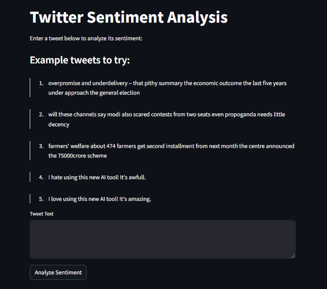

# Sentiment Analysis Project


## Features
- Preprocessing of text data.
- Sentiment classification using machine learning or deep learning models.
- Visualization of sentiment analysis results.

## Installation
1. Clone the repository:
    ```bash
    git clone https://github.com/Gouravlohar/sentiment_c
    ```
2. Navigate to the project directory:
    ```bash
    cd sentiment_c
    ```
3. Install the required dependencies:
    ```bash
    pip install -r requirements.txt
    ```